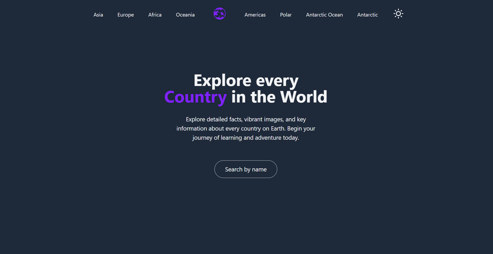
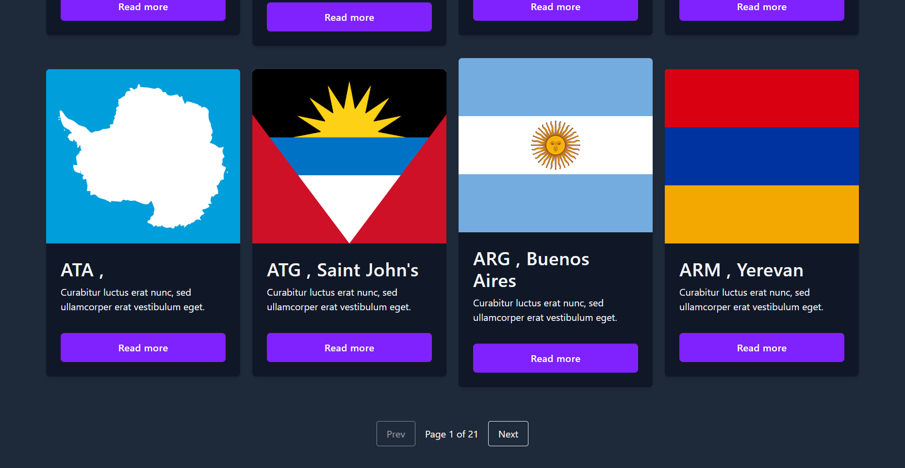
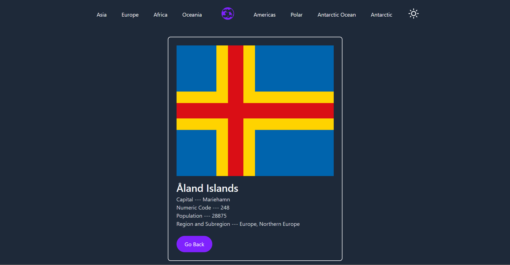

# Country App with React & Tailwind CSS
👉 [View the web](https://ruhlanscountryapp.vercel.app/countries)

## 🌎 Countries App

A React-based web application that displays a list of countries with region-based filtering.  
It supports light/dark theme switching and responsive design for mobile and desktop.

## ✨ Features

🌐 Browse countries by region (e.g., Europe, Asia, Africa, etc.) 
🔎 URL-based region filtering using React Router 
🌙 Light/Dark mode toggle with localStorage theme persistence 
📱 Mobile-friendly sidebar navigation 
⚡ Fast and fully client-side rendered 
🚀 Live Demo 
👉 View the app 

## 🛠️ Tech Stack
React 
React Router 
Tailwind CSS 
React Icons 
Vite (or CRA, depending on your setup) 

## Some pictures from website :

  
  
